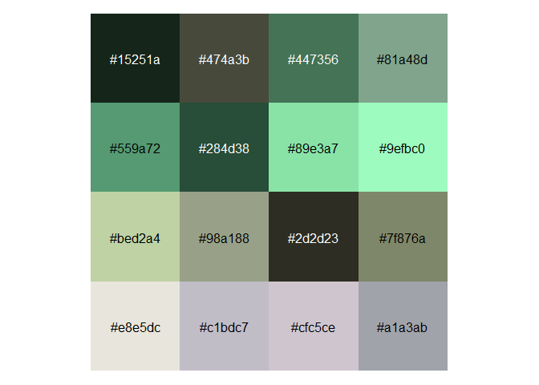
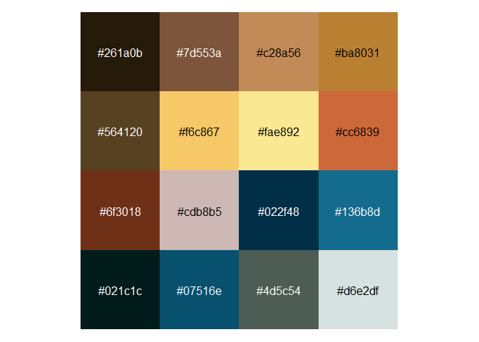
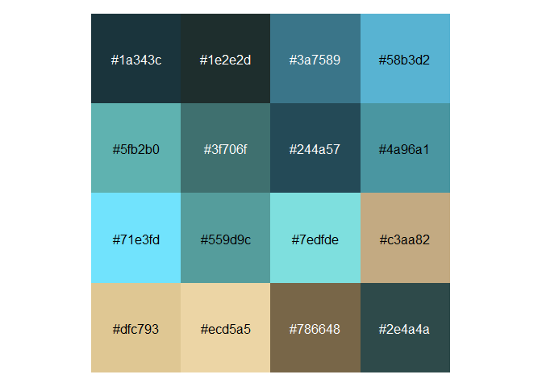
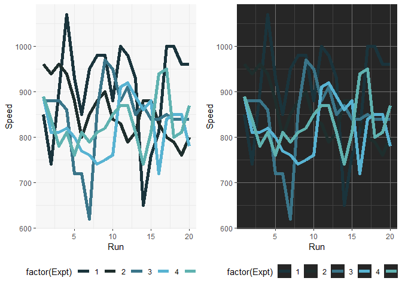
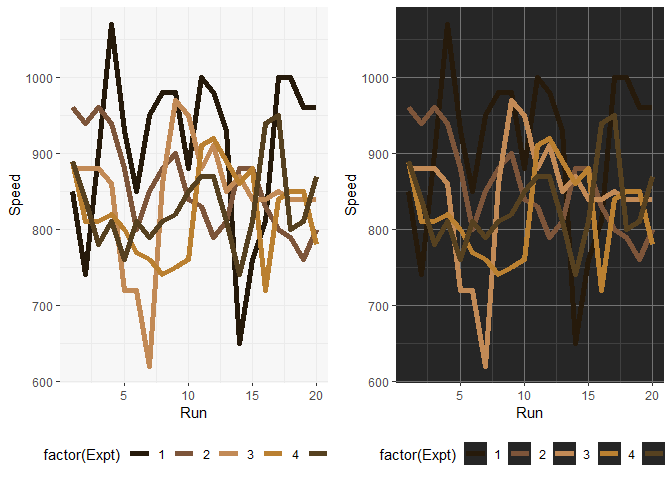
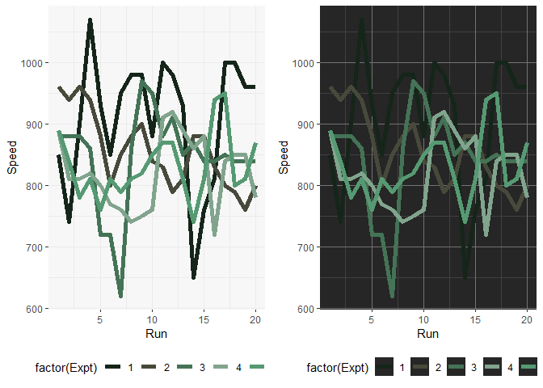
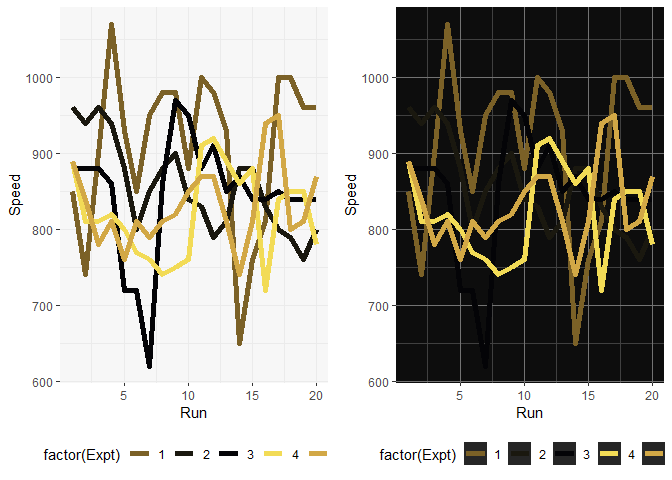
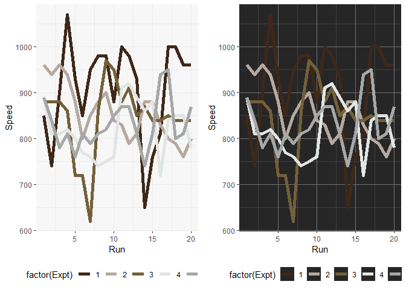
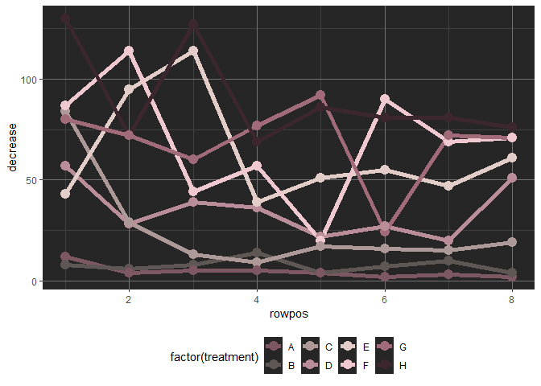

<!-- README.md is generated from README.Rmd. Please edit that file -->

# `pokecolors`

<!-- badges: start -->
<!-- badges: end -->

Color palettes based on Gen 1 and Gen 2 Pokémon for use in R. Package
inspiration from [Barry Mode](https://github.com/BarryMode/pokepalettes)
and [Jared Huling](https://github.com/jaredhuling/jcolors).

# Installation

You can install the development version of `pokecolors` from
[GitHub](https://github.com/) with:

``` r
# install.packages("devtools")
devtools::install_github("Angela-Jones/pokecolors")
```

# Get color palettes

Access the `pokecolors` color palettes by name or number with
`pokecolors()`:

``` r
library(pokecolors)
pokecolors('squirtle')
#>  [1] "#1a343c" "#1e2e2d" "#3a7589" "#58b3d2" "#5fb2b0" "#3f706f" "#244a57"
#>  [8] "#4a96a1" "#71e3fd" "#559d9c" "#7edfde" "#c3aa82" "#dfc793" "#ecd5a5"
#> [15] "#786648" "#2e4a4a"
pokecolors('007')
#>  [1] "#1a343c" "#1e2e2d" "#3a7589" "#58b3d2" "#5fb2b0" "#3f706f" "#244a57"
#>  [8] "#4a96a1" "#71e3fd" "#559d9c" "#7edfde" "#c3aa82" "#dfc793" "#ecd5a5"
#> [15] "#786648" "#2e4a4a"
```

Access a random color palette:

``` r
pokecolors('random')
#>  [1] "#57656e" "#24141d" "#95a19d" "#8495a1" "#272f34" "#646c6a" "#565753"
#>  [8] "#151817" "#9f9f9e" "#1c1b1b" "#e1e2de" "#cfdbd8" "#b2c5bf" "#708191"
#> [15] "#cbd6db" "#343f4e"
```

# Display color palettes

Color palettes can be displayed using `display_pokecolors()`

## Bulbasaur

``` r
display_pokecolors("bulbasaur")
```



## Charmander

``` r
display_pokecolors("charmander")
```



## Squirtle

``` r
display_pokecolors("squirtle")
```



# Use palettes with `ggplot2`

Now use `scale_color_pokecolors()` with `ggplot2`:

``` r
library(ggplot2)
library(gridExtra)
data(morley)
pltl <- ggplot(data = morley, aes(x = Run, y = Speed,
group = factor(Expt),
colour = factor(Expt))) +
    geom_line(size = 2) +
    theme_bw() +
    theme(panel.background = element_rect(fill = "grey97"),
          panel.border = element_blank(),
          legend.position = "bottom")
pltd <- ggplot(data = morley, aes(x = Run, y = Speed,
group = factor(Expt),
colour = factor(Expt))) +
    geom_line(size = 2) +
    theme_bw() +
    theme(panel.background = element_rect(fill = "grey15"),
          legend.key = element_rect(fill = "grey15"),
          panel.border = element_blank(),
          panel.grid.major = element_line(color = "grey45"),
          panel.grid.minor = element_line(color = "grey25"),
          legend.position = "bottom")
grid.arrange(pltl + scale_color_pokecolors(palette = "squirtle"),
             pltd + scale_color_pokecolors(palette = "squirtle"), ncol = 2)
```



``` r
grid.arrange(pltl + scale_color_pokecolors(palette = "charmander"),
             pltd + scale_color_pokecolors(palette = "charmander"), ncol = 2)
```



## More example plots

``` r
grid.arrange(pltl + scale_color_pokecolors(palette = "bulbasaur"),
             pltd + scale_color_pokecolors(palette = "bulbasaur"), ncol = 2)
```



``` r
grid.arrange(pltl + scale_color_pokecolors(palette = "pikachu"),
             pltd + scale_color_pokecolors(palette = "pikachu") + 
                 theme(panel.background = element_rect(fill = "grey5")), ncol = 2)
```



``` r
grid.arrange(pltl + scale_color_pokecolors(palette = "magikarp"),
             pltd + scale_color_pokecolors(palette = "magikarp"), ncol = 2)
```



``` r
pltd <- ggplot(data = OrchardSprays, aes(x = rowpos, y = decrease,
group = factor(treatment),
colour = factor(treatment))) +
    geom_line(size = 2) +
    geom_point(size = 4) +
    theme_bw() +
    theme(panel.background = element_rect(fill = "grey15"),
          legend.key = element_rect(fill = "grey15"),
          panel.border = element_blank(),
          panel.grid.major = element_line(color = "grey45"),
          panel.grid.minor = element_line(color = "grey25"),
          legend.position = "bottom")
pltd + scale_color_pokecolors(palette = "jigglypuff")
```


